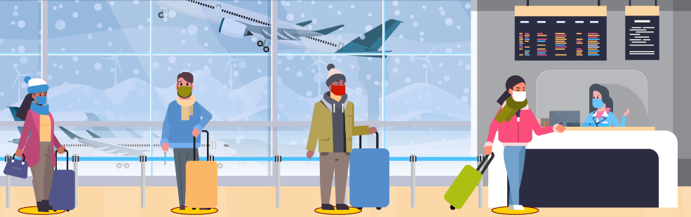

## ATSS College - Web wonders Technical Event

---

### Features supported by Page:

- Mobile First Design.
- Can Run on any modern browser in Laptop/Desktop/Mobile/Tablet or any other device.
- Build with lightweight CSS Library (Bulma).
- Single Page and Static in Nature.

### How to run?

- You can simply click on `index.html` and choice any browser to open it [Please do not use *Internet Explorer*]
- You can also host it with local XAMPP/Apache Server (I am using PHP Development Server for Testing the page.)
- You can simply click and visit the website
  https://dreamsdoor.co.in/atss-web-wonders

- Screen of HomePage.
  

### Note about the Resources

- Most of Resource (mainly images) are taken from Ministery of Health and Family Welfare (under fair use policy).
- Below attached image is taken from US-CDC (United State - Centers for Disease Control and Prevention)

  

### Prerequisite

- For better look of `fonts` _internet connectivity_ is must.
- Any modern browser with `CSS3` and `HTML5` support.

<b>Live for Next 2 Days on </b>
https://dreamsdoor.co.in/atss-web-wonders

&copy; - 2021 Rajendra Kumar R. Yadav.
